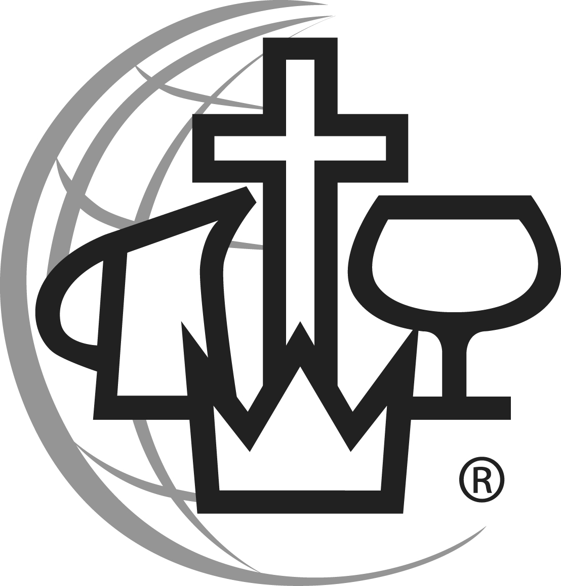
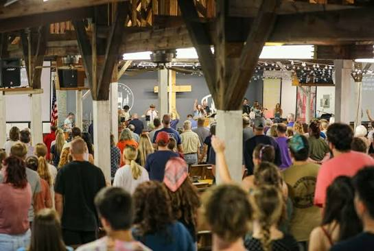
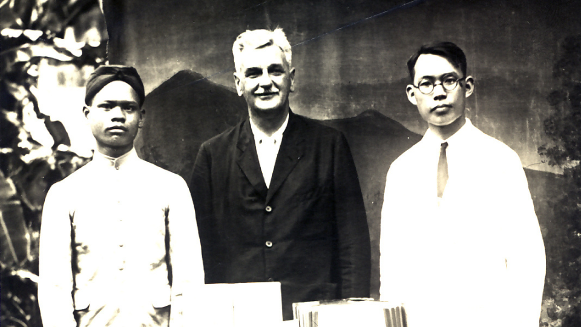
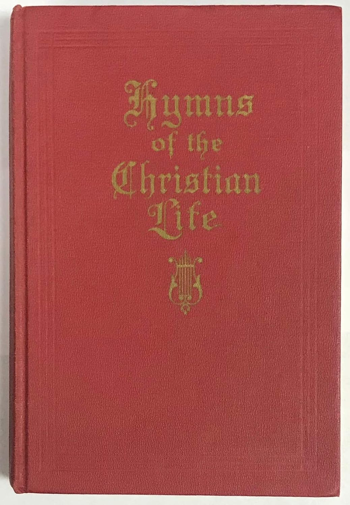
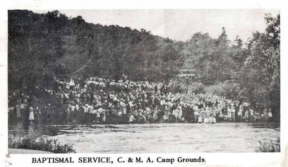

I grew up in the Christian and Missionary Alliance from infancy. Because my family lacked reliable transportation, we often attended one of two C&MA churches depending on who could give us a ride. Much of our week revolved around church activities.

<figure style="float:right;margin: 0 15px 15 px 0;display:inline-grid;grid-template-columns: minmax(0, max-content);max-width:1108px">
  
  <figcaption style="font-style: italic;overflow-wrap: break-word">The Christian and Missionary Alliance was founded in 1887 by A.B. Simpson with the goal of fulfilling the Great Commision to go and make disciples of all nations.</figcaption>
</figure>

I also attended a C&MA elementary school, where the faith was taken seriously. In the mornings we would pledge allegiance to both the American and Christian flags (*I pledge allegiance to the Christian flag, and to the Savior for whose Kingdom it stands; one Savior, crucified, risen, and coming again with life and liberty to all who believe*). Often we would pledge allegiance to the Bible (*I pledge allegiance to the Bible, God’s holy Word, I will make it a lamp unto my feet and a light unto my path and will hide its words in my heart that I might not sin against God.*). Bible classes were a regular part of the curriculum, and weekly chapel services were held. 

During the summers, I attended a C&MA Bible camp. My grandparents owned a cottage on the campground, and many of my childhood memories are tied to that place. During Family Camp, my cousins and I slept together on the back porch during hot summer nights. We attended children's programs and youth services, often gathering twice a day throughout the ten-day camp. From an early age, I was immersed in that revivalist form of Christianity. I loved the camp meetings, the services, and the sense of spiritual excitement that surrounded them. In every direction, my world was shaped by this tradition. Looking back, I would say that I was fully immersed in the *phronema* (mindset, outlook, way of thinking) of the Christian and Missionary Alliance, even though I would not learn that word until much later.

<figure style="float:right;margin: 0 15px 15 px 0;display:inline-grid;grid-template-columns: minmax(0, max-content);max-width:545px">
  
  <figcaption style="font-style: italic;overflow-wrap: break-word">A typical C&MA camp service combines passionate preaching, stirring music, altar calls, and public acts of commitment such as river baptisms. For many attendees, including myself, these emotionally powerful gatherings become defining moments in their spiritual journey.</figcaption>
</figure>

The C&MA of my childhood felt somewhat old-fashioned by today's standards. Men commonly wore suits and ties to church, while women dressed modestly, and old hymns were sung regularly. Certain activities, such as dancing, playing cards, and drinking alcohol, were discouraged or forbidden. Although these standards were not observed universally and gradually faded during the 1980s and 1990s, my family, especially my grandparents' generation, continued to follow them closely.

It was a world saturated with Scripture and church culture. We sang songs about the Bible (The B-I-B-L-E, yes, that's the book for me!), memorized verses, practiced "sword drills" (a game to see how quickly someone could locate a Bible passage), participated in Bible quizzing, and attended Sunday School, Vacation Bible School, and Missions Conferences. Some of my earliest memories are tied to those activities. It was a wonderful environment in which to be a child.

Missions Conferences were another important part of church life. Because the Christian and Missionary Alliance placed such a strong emphasis on missions, these events were always well attended. Missionaries would visit and share stories about their work around the world. Their presentations often included remarkable accounts of how God provided for a need or protected them in dangerous situations.

They brought clothing, artifacts, and photographs from places many of us had never imagined visiting, and they would often dress in traditional local attire. Sometimes they even gave us children small gifts or trinkets. For a child growing up in rural Pennsylvania, those presentations were fascinating. Many of us dreamed of becoming missionaries ourselves, or at least deeply admired those who did.

<figure style="float:right;margin: 0 15px 15 px 0;display:inline-grid;grid-template-columns: minmax(0, max-content);max-width:960px">
  
  <figcaption style="font-style: italic;overflow-wrap: break-word">Dr. Robert A. Jaffray, an Alliance missionary to Asia, who perished in a Japanese prison camp during WW2.</figcaption>
</figure>

On Sunday mornings, while the adults gathered in the sanctuary for worship, we children attended our own junior church service. It was like a parallel service for kids, a mirror of what was happening in the main sanctuary. We sang hymns, took an offering, and listened to a sermon or lesson taught by one of the pastors’ wives. My mother played the piano for these services, and I often helped by holding the hymnal and turning the pages.

We loved choosing our favorite hymns from the old hymnal, songs like The Old Rugged Cross, Amazing Grace, and Blessed Assurance. I loved those hymnals: the look and feel of them, and even their musty old smell. As a child, I imagined these hymns were older than they really were; most were written in the nineteenth century. Looking back, I realize that our tradition was relatively young. Yet it never felt that way to me. I felt as though I belonged to an unchanging faith and assumed it had always been, and always would be, this way.

There was a sense of continuity with the generations that came before me. At the time, I was not really thinking about those who would come after me, but that question eventually became a major factor in my decision to convert to Holy Orthodoxy.

<figure style="float:right;margin: 0 15px 15 px 0;display:inline-grid;grid-template-columns: minmax(0, max-content);max-width:1038px">
  
  <figcaption style="font-style: italic;overflow-wrap: break-word">An edition of the hymn books we used in Junior Church. My mom still has one in her piano bench to this day.</figcaption>
</figure>

We were taught a simple gospel message. God loved us, but our sins had separated us from Him, leaving us under His wrath and deserving eternal punishment. Yet Jesus came into the world and died on the cross for our sins, satisfying the Father's justice so that we could be forgiven and spend eternity with Him in heaven. All we had to do was believe in Him.

This gospel was preached from our pulpit, proclaimed at summer camp, and popularized by evangelists such as Billy Graham. We encountered it in children's ministries through tools like the Wordless Book, through verses such as John 3:16, and through countless sermons, tracts, and invitations to faith. We were given many opportunities to get right with God and be saved. I believed this message wholeheartedly.

I remember "getting saved" at a young age. In the tradition in which I was raised, being saved meant having your sins forgiven and spending eternity with Christ in heaven. The way one became saved was by repenting of sin and asking Jesus to come into one's heart. There was no official formula, but it usually took the form of a prayer, something like this:

"Lord Jesus, I know that I am a sinner. I know that You died on the cross for my sins. Please come into my heart, forgive my sins, and take me to heaven to be with You when I die. Amen."

I sincerely prayed that prayer, and I genuinely loved Jesus. I remember feeling deep gratitude and affection for Him because He had died for me. When we sang songs such as I Am So Glad That Jesus Loves Me, I sang them from the heart. As far as I knew, my faith was real.

Yet I did not always have assurance that I was saved. On the one hand, I was taught that if I sincerely prayed and truly meant it, I was saved. On the other hand, whenever someone struggled spiritually or drifted from the faith, people would sometimes ask, "Were they ever really saved?" or "Did they truly mean it?" Those questions unsettled me. If salvation depended on sincere belief, how could I know whether I had been sincere enough?

As a result, I repeatedly prayed the sinner's prayer. I cannot say how many times I asked Jesus to come into my heart. My mother and Sunday school teachers often reassured me that I did not need to keep doing it, that once was enough. Even so, they were patient and kind, and they would pray with me again whenever I asked because they knew I was struggling with doubt.

Looking back, I see that even a child can sense the uncertainty that comes from wondering whether he has believed sincerely enough. I often wavered between assurance and doubt. If I truly was saved, there was no need to pray again. But if I had not been sincere enough the first time, perhaps I was still lost.

At the time, I did not realize that this tension arose from theological assumptions embedded in the soteriology of my tradition, particularly ideas associated with Calvinism, such as the Perseverance of the Saints. If those who are truly saved will inevitably persevere to the end, then doubts naturally follow: How do I know I was sincere enough? What if I only think I am saved? What if I become one of those people who falls away?

I was also unaware of the ancient and historic Christian understanding of salvation as more than a legal declaration. In that tradition, salvation is a lifelong process of healing, transformation, and deification through communion with God. Instead of asking, "Was I sincere enough when I prayed the sinner's prayer?" I could have been asking, "Am I turning toward Christ now?"

That tension stayed with me as I grew older, and it became even more significant when I began serving as a youth leader and found myself helping other young people wrestle with the same questions.

I was baptized as a young child, around nine years old. I remember feeling good about the experience and thinking it was kind of fun. Beyond that, I do not remember much about the day itself.

I understood baptism as an outward sign of an inward change, which is how the Christian and Missionary Alliance describes it. There was no belief that baptism itself forgave sins or accomplished anything of that nature. I knew Christians in our church who had never been baptized. They simply did not see it as a priority, or viewed it as something they would get around to eventually.

Occasionally, during baptism services, an elderly person who had attended church his or her entire life would finally be baptized. They always seemed genuinely excited about it. Looking back, I wonder whether one's perspective on baptism changes with age, especially if one has never experienced it. Perhaps they were trying to cover their bases. Who knows?

What struck me as odd, however, was that before nearly every baptism service, the pastor would preach a sermon emphasizing that baptism does not save you. It was as though the underlying theology was more important than the ordinance itself. In fact, we never referred to baptism as a sacrament. The emphasis was not on what baptism was, but on what baptism was not.

At the time, I had no idea how unusual that view was historically. The Christians of the early Church spoke of baptism as the forgiveness of sins, new birth, union with Christ, and entrance into the Church. The Nicene Creed itself proclaims, "I acknowledge one baptism for the remission of sins." The New Testament likewise speaks of baptism in strikingly powerful terms. Yet none of this was part of my understanding as a child.

Years later, as I began studying Christian history, I discovered that even many of the Protestant Reformers viewed baptism as a means of grace and associated it with regeneration or the remission of sins. The idea that baptism is merely a symbol appeared much later and became especially influential through revivalist traditions that placed the emphasis on a personal conversion experience. Salvation became closely associated with a decision for Christ, while baptism increasingly became secondary. But I knew none of this at the time. To me, baptism was important, yet somehow not important enough to matter very much.

<figure style="float:right;margin: 0 15px 15 px 0;display:inline-grid;grid-template-columns: minmax(0, max-content);max-width:585px">
  
  <figcaption style="font-style: italic;overflow-wrap: break-word">A baptismal service at a C&MA camp.</figcaption>
</figure>

When I entered my teenage years, I joined the church youth group. This marked a major transition in my life because I had reached the age when we were encouraged to make the faith our own. It was no longer enough to rely on the faith of our parents or grandparents. We were expected to develop a personal faith and a personal relationship with Christ.

I was entering a new world filled with fun, chaos, anxiety, emotion, and powerful experiences. Our youth leader poured her heart and soul into the group. She invested countless hours planning activities, encouraging us, and introducing us to Christian music by bands such as DC Talk, Skillet, Relient K, and many others.

We regularly held special events at the church. One of the most memorable was the lock-in, where we spent an entire night, and sometimes nearly twenty-four hours, at the church. These events were fun, energetic, and often a little chaotic. We also participated in programs such as the 30 Hour Famine, going without food to raise money and awareness for children suffering from hunger around the world. At times, we ventured into the community for scavenger hunts and other activities that occasionally got us into trouble.

Among all the events and activities, however, the most powerful were the weekend retreats.

Youth retreats followed a fairly predictable pattern. We would arrive on Friday and stay through Sunday, participating in four main worship services over the course of the weekend. The third service, held on Saturday night, was typically the turning point. It was the moment when students were encouraged to make a decision for Christ, come forward to the altar, pray, worship, and recommit their lives to Him.

I experienced one of those moments during a retreat in high school. The preaching was intense. I had never felt so convicted before. Combined with the worship music and a weekend of very little sleep, I was primed to make a decision for Christ. During the Saturday evening service, I went forward to the altar and broke down in tears. I cried so hard that my shoulders shook. One of the youth leaders put his arm around me, prayed for me, and tried to comfort me.

At the time, I could not have explained exactly what was happening. I only knew that I felt deeply sorry for my sins. I felt that I had disappointed God, and I longed for His forgiveness, acceptance, and love. This felt like a real conversion. The sinner's prayer I had prayed as a child seemed little more than a formality by comparison.

The feelings did not last. Eventually, I came down from the spiritual high and returned to my normal life, focused on selfish pleasures, having fun, and pursuing girls. Looking back, that experience was the first in a series of moments that another author has called the "rededication cycle," a concept I will discuss later.

Even so, I do not look back on that experience as insincere or artificial. Whatever else may be said about it, it was real to me. I remember the conviction I felt, the emotions I experienced, and the commitment I made that night to follow Christ.

Although I failed many times afterward and would experience similar moments again in the years that followed, I still view that retreat as a significant turning point. It marked a sincere commitment to Christ and remains one of the defining spiritual experiences of my youth.

I will return to that moment shortly, but first I need to explain the religious framework in which I was spiritually formed. Several influences uniquely shaped my experience and the kind of Christianity I inherited. The first of these was prophecy culture and dispensationalism.

  <a href="/memoir/introduction">← Previous Section: Introduction</a>
  <a href="/memoir">Home</a>
  <a href="/memoir/prophecy-culture-and-dispensationalism">Next Section: Prophecy Culture and Dispensationalism →</a>

