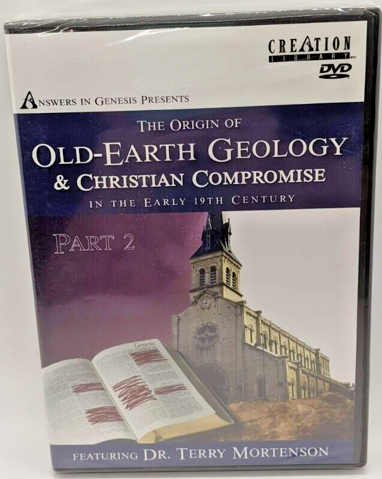
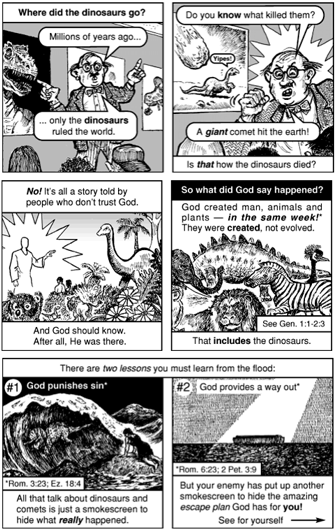
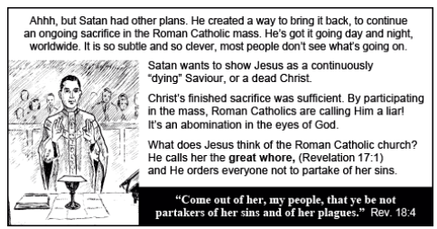

## It is Necessary That You Understand

One of the accusations people confront me with when they hear I converted to Orthodoxy is that the Orthodox Church is exclusionary, meaning it believes there is no safety in salvation outside the Orthodox Church. On the surface, that accusation seems legitimate. After all, aren’t we all Christians? Shouldn’t we just focus on Jesus rather than all this other stuff?

Yet my own tradition had an exclusivism it didn’t even recognize. It taught that anyone who was a “born-again believer” was saved, but in practice, believing in Christ was not always enough. You also had to have the correct understanding of what you believed, or your salvation could be called into question.

For example, it wasn’t enough to believe that Christ died on the cross for our sins. You were expected to affirm Penal Substitutionary Atonement, and those who rejected it often found their salvation questioned. The idea that a sincere faith was not enough, and that salvation depended on holding the right theological formulations, deeply troubled me.

I was constantly afraid that I might be wrong about some obscure doctrine that would ultimately prove essential. Looking across the many Christian denominations, I found myself wondering which one had the most correct beliefs. At times, it felt as though salvation depended on passing a theology exam.

<blockquote style="float:right;margin: 0 15px 15 px 0;display:inline-grid;grid-template-columns: minmax(0, max-content);max-width:400px">
  <a href="https://en.wikipedia.org/wiki/Penal_substitution">Penal Substitutionary Atonement</a> teaches that Jesus was punished in the place of sinners, bearing the penalty they deserved; this understanding of the atonement was developed during the Protestant Reformation and became a distinctive emphasis of Calvinist theology. <a href="https://en.wikipedia.org/wiki/Recapitulation_theory_of_atonement">The Orthodox doctrine of recapitulation</a> instead emphasizes Christ's restoration of humanity by retracing and correcting the path of fallen mankind, defeating the powers of sin, death, and the demons through His incarnation, death, and resurrection.
</blockquote>

Another example had to do with works. I was taught that Christians should do good works, but there was also a strong emphasis on avoiding anything that sounded like "works righteousness." If someone spoke of their works as pleasing to God or as participating in their salvation, they could be accused of trusting in themselves rather than in Christ. While I understood the concern, I often struggled to make sense of where obedience and spiritual effort fit into the Christian life.

Sometimes the reaction against works righteousness was so strong that it almost felt as though good works themselves were suspect. I knew Christians were expected to do good things, yet I often came away with the impression that there was essentially nothing good I could do that played any meaningful role in my relationship with God. It seemed safer to speak about what Christ had done than about any effort on my part to follow Him. Whether that was the intended message or not, the message I absorbed was that the most important thing was making sure I had accepted Jesus and held the correct beliefs about salvation. Over time, I found myself wondering whether I was being called merely to believe certain truths or to actively cooperate with God's grace in becoming a different kind of person.

Another example was the issue of creation and evolution. In my circles, a young-earth view of Genesis, popularized by figures such as Ken Ham and Kent Hovind, was often treated as the only faithful Christian position. If you did not believe the earth was roughly 6,000 years old or that the days of Genesis 1 were literal twenty-four-hour periods, you were frequently seen as compromising biblical truth. I sometimes encountered the impression that acceptance of evolution was not simply an intellectual disagreement but part of a broader drift away from Christianity itself.

<figure style="float:right;margin: 0 15px 15 px 0;display:inline-grid;grid-template-columns: minmax(0, max-content);max-width:500px">
  
  <figcaption style="font-style: italic;overflow-wrap: break-word">An <i>Answers in Genesis</i> film accuses Christians who accept an old earth of "compromise."</figcaption>
</figure>

What troubled me was not that people held strong convictions about Genesis, but that the issue could become a test of salvation. The conversation often seemed less about weighing evidence and more about determining whether someone was truly faithful to Scripture. In some cases, a person's view of evolution could even raise questions about the authenticity of their faith. As a result, I found myself wondering how a belief about the age of the earth had become so closely connected to assurances of salvation.

<figure style="float:right;margin: 0 15px 15 px 0;display:inline-grid;grid-template-columns: minmax(0, max-content);max-width:335px">
  
  <figcaption style="font-style: italic;overflow-wrap: break-word">Portions of a "Chick Tract" laying out the argument that people who accept evolution don't trust God, and are actually trying to hide the truth from you.</figcaption>
</figure>

To be clear, I fully agreed with and defended everything I was taught by the creationists. I was not a skeptic looking in from the outside. Yet this issue would eventually become the first major pillar to fall during my deconstruction in my twenties, when I discovered that sincere, Bible-believing Christians held a variety of views on origins. For the first time, I began to realize that faithful Christians could disagree on important questions without rejecting Christ or abandoning the authority of Scripture.

We kids were often entertained and indoctrinated through the use of Chick tracts. These were comic‑style pamphlets meant to evangelize, but they were so polemical that they came across as downright hateful. <a href="https://www.chick.com/products/tract?stk=82&ue=d">The comics outright stated that Catholics were going to hell.</a> They implied that mainline Protestants were probably going to hell. People who believed in evolution were going to hell. Basically, everyone was going to hell except the people who believed in the exact caricature of Christ being presented in the comic strip.

<figure style="float:right;margin: 0 15px 15 px 0;display:inline-grid;grid-template-columns: minmax(0, max-content);max-width:484px">
  
  <figcaption style="font-style: italic;overflow-wrap: break-word">A Chick Tract referring to the Roman Catholic Church as the Whore of Babylon.</figcaption>
</figure>

Now, as an adult, I realize these comics are ridiculous, but as a child I accepted them as an authority. My parents gave them to me, and they were produced by a Christian publishing house—which I assumed was legitimate. We all have authorities and worldviews we subscribe to, whether we say it out loud or not.

Some of the other things Chick tracts claimed were that the Roman Catholic Church was the Whore of Babylon, that the Pope and Satan were in a conspiracy together to form a one‑world religion, that catholics have a double loyalty between the United States and Vatican City, and many other similar accusations. As an Orthodox Christian now, I recognize some of these same attacks being directed at me—even though I’m not Catholic, and even though there are many differences between Catholics and Orthodox. But some of the similarities between us would be enough for Jack Chick to send us to hell.

There were some real problems with this exclusivism that bothered me immensely as a child, and they’ve only been resolved for me now that I belong to the Orthodox Church. One of the biggest issues involved my family. My dad’s side of the family was Roman Catholic, and hearing my mother tell me that my grandmother was going to hell did something to me that was deeply damaging. It forced me into a terrible dilemma: either God was evil and capricious, or my mom was wrong.

My grandmother loved God. She prayed every day. She loved Him deeply. She believed in Jesus. She trusted Him as her savior. How could God send someone to hell who loves Him and wants to be with Him, just because her theology was “incorrect”? To me, even as a child, that felt absolutely insane and profoundly wrong.

Another issue had to do with the fate of those who had never heard of Christ at all. These were the people we called “the lost” in our church, and part of the goal of mission work was to send missionaries out to save them. You’ll notice this isn’t exactly what the Great Commission tells us to do in Matthew; it tells us to make disciples, which is different from “saving the lost.” Without getting too deep into that distinction, my childhood heart simply could not accept the idea that a loving God would consign billions of people to hell for the sin of not knowing He existed. If they didn’t know He existed, how could they be punished for offending Him?

Yes, the Bible says that what is important to know about God is made manifest through His creation. But to me, that actually supported my point: it suggests someone can come to know God through creation itself without ever hearing the name of Jesus or knowing anything about a cross.

In a way, I almost had a kind of survivor’s guilt—feeling that I didn’t deserve to be born in America, where I could hear the gospel. It all felt arbitrary. Later on, I realized this came from Calvinist theology infecting our faith, even though nobody I knew ever said that out loud.

I rest more easily now knowing that Christ is the Savior of the whole world and that all will be raised and face the judgment. Christ is a merciful judge. I’m not claiming to know what His judgments will be for any particular person, but I know they will not be capricious, arbitrary, or random. Because otherwise it would mean geography matters more than mercy, and the time and place you were born matters more than what He did for you on the cross. Essentially, it would mean God’s love has borders.

Looking back, I think the common thread running through all of this was how intellectualized faith had become. Because salvation was understood primarily in terms of belief, and because good works were carefully separated from any role in salvation, it often felt as though everything hinged on believing the right things. In theory, all a person had to do was believe in Jesus. In practice, however, there seemed to be an ever-expanding list of beliefs that functioned as tests of whether that faith was genuine.

Questions about the atonement, creation, alcohol, spiritual gifts, end-times prophecy, and countless other issues could become indicators of whether someone was truly saved. Officially, no one claimed to know the state of another person's soul. Yet there was an underlying tendency to evaluate people through the lens of their beliefs and practices, searching for evidence that their profession of faith was authentic.

I remember sitting in church and quietly wondering about the people around me. Did they really believe the right things? Were they trusting in Christ alone, or in their works? What did they think about evolution? Were their convictions biblical enough? The irony was that a tradition that spoke constantly about assurance often left me feeling uncertain. Not only was I uncertain about myself, but I found it difficult to feel certain about anyone else.

What struck me as especially strange was that this version of Christianity often presented itself as the simplest possible faith. The message was frequently reduced to a few essential beliefs: accept Jesus, believe the gospel, and be saved. Yet at the same time, entire groups of Christians, including Orthodox, Catholics, and many mainline Protestants, were often regarded with deep suspicion or excluded altogether. The faith was presented as a lowest-common-denominator Christianity, but in practice the boundaries seemed much narrower than its simplicity suggested.

  <a href="/memoir/prophecy-culture-and-dispensationalism">← Previous Section: Prophecy Culture and Dispensationalism</a>
  <a href="/memoir">Home</a>
  <a href="/memoir/fear">Next Section: Fear →</a>

