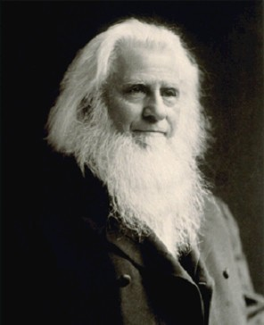

Looking back, I realize that I grew up inside a distinct evangelical subculture. There were Christian alternatives to everything: Christian music, Christian radio, Christian bookstores, Christian camps, Bible quizzes, youth conventions, and Christian versions of popular entertainment. If there was a Christian version of something, that was usually the version you were expected to choose. We didn't just practice Christianity. We lived inside a Christian bubble with its own music, celebrities, businesses, and unwritten social expectations.

<figure style="float:right;margin: 15px 15px 15px 15px;display:inline-grid;grid-template-columns: minmax(0, max-content);max-width:500px">
  
  <figcaption style="font-style: italic;overflow-wrap: break-word">Family Life Radio, one of many Christian radio stations whose signal I could get where I lived.</figcaption>
</figure>

The system was also highly legalistic. Entertainment was lightly policed, and don't get me wrong, I think discernment matters. We should be careful about what we allow into our minds. But combined with a host of other rules and expectations, life could sometimes feel oppressive. Alcohol was strictly forbidden for any reason, and there were all sorts of creative attempts to make the prohibition sound biblical, including claims that the wine Jesus made was actually unfermented grape juice. Give me a break.

<figure style="float:right;margin: 15px 15px 15px 15px;display:inline-grid;grid-template-columns: minmax(0, max-content);max-width:500px">
  
  <figcaption style="font-style: italic;overflow-wrap: break-word">Thomas Bramwell Welch (31 December 1825 – 29 December 1903) was a British–American Methodist minister and dentist. He pioneered the use of pasteurization as a means of preventing the fermentation of grape juice. He persuaded local churches to adopt this non-alcoholic wine substitute for use in Holy Communion, calling it "Dr. Welch's Unfermented Wine". The company he founded is now called Welch's, which produces grape juices, jams and jellies. <a href="https://en.wikipedia.org/wiki/Thomas_Bramwell_Welch">Wikipedia</a></figcaption>
</figure>

Purity culture was also at its peak during my formative years. Influenced by figures like Joshua Harris and books such as I Kissed Dating Goodbye, churches promoted purity rings, purity pledges, and father-daughter purity ceremonies. Many of us were taught that sexual sin would leave a permanent stain on our lives. Yes, God could forgive you, but we were often told that you could never truly regain what had been lost. The result was not holiness. It was fear, anxiety, and shame. Sexual failure felt almost unforgivable. You could be redeemed in theory, but in practice many of us felt permanently damaged.

<figure style="float:right;margin: 15px 15px 15px 15px;display:inline-grid;grid-template-columns: minmax(0, max-content);max-width:500px">
  
  <figcaption style="font-style: italic;overflow-wrap: break-word">I Kissed Dating Goodbye is a 1997 book by Joshua Harris. The book focuses on Harris' disenchantment with the contemporary secular dating scene, and offers ideas for improvement, alternative dating/courting practices, and a view that singleness should neither need to be a burden nor should it be characterized by what Harris describes as "selfishness". By the late 2010s, Harris reconsidered his view that dating should be avoided, apologizing to those whose lives were negatively impacted by the book and directing the book's publisher to discontinue its publication. <a href="https://en.wikipedia.org/wiki/I_Kissed_Dating_Goodbye">Wikipedia</a></figcaption>
</figure>

Ironically, the emphasis on rules often encouraged people to look for loopholes. Instead of asking, "How can I honor God in this relationship?" young people would ask, "How far can we go without technically crossing the line?" The focus shifted from cultivating virtue to avoiding specific prohibited actions. Legalism did not eliminate temptation. It simply changed how we dealth with it.

Many of us were also taught that God had one specific will for every major decision in life: whom we should marry, where we should attend college, what career we should pursue, and where we should live. The challenge was figuring out how to discover this hidden blueprint. Ordinary choices became sources of spiritual stress because nobody wanted to accidentally step outside of God's perfect will.

I desperately wanted to be a serious Christian. I carried my Bible to school, joined prayer circles before class, attended retreats, went to Bible studies, and volunteered at church whenever I could. In high school, groups of us would gather on the floor before class to read Scripture and pray together. Much of it was sincere, including my own participation. Yet despite all the activity, my inner life with God remained shallow. I knew how to perform Christianity long before I learned how to pray.

The funny thing is that when I became Orthodox, I received criticism from people who claimed that Orthodoxy was legalistic because of its fasting rules, liturgical worship, and traditions. Yet my experience has been exactly the opposite. Orthodoxy is the least legalistic form of Christianity I have ever encountered. Yes, there is fasting, confession, prayer, preparation for Holy Communion, and a host of spiritual disciplines. But these are not presented as a checklist for earning God's favor. They are tools for healing and transformation. Oddly enough, I found more freedom through spiritual discipline than I ever found through rule-keeping. For the first time in my life, I no longer feel as though my relationship with God is governed by an endless list of regulations. Instead, I feel invited into a life of repentance, growth, and communion with Him.

  <a href="/memoir/fear">← Previous Section: Fear</a>
  <a href="/memoir">Home</a>
  <a href="/memoir/revivalism">Next Section: Revivalism →</a>

