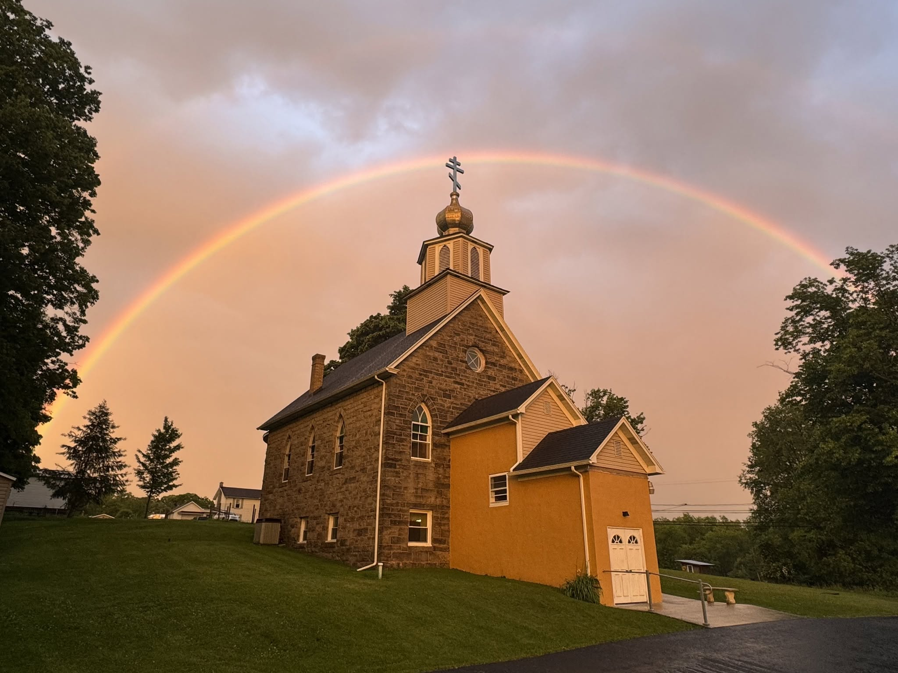

<figure>
  
</figure>

# Why I Converted to Eastern Orthodox Christianity

A memoir of my journey from Evangelicalism to Eastern Orthodoxy. You may begin by going to the [Introduction](/chapters/introduction/) or browse the table of contents below.

## Contents

- [Introduction](/chapters/introduction/)
- [Early Faith](/chapters/early-faith.md)
- [Prophecy Culture and Dispensationalism](/chapters/prophecy-culture-and-dispensationalism.md)
- [Exclusivism](/chapters/exclusivism.md)
- [Fear](/chapters/fear.md)
- [Legalism](/chapters/legalism.md)
- [Revivalism](/chapters/revivalism.md)
- [Rise of Modern Worship Culture](/chapters/rise-of-modern-worship-culture.md)
- [The Good That Shaped Me](/chapters/the-good-that-shaped-me.md)
- [Deconstruction](/chapters/deconstruction.md)
- [Great Books of the Western World](/chapters/great-books-of-the-western-world.md)
- [Augustine](/chapters/augustine.md)
- [Owning My Faith](/chapters/owning-my-faith.md)
- [Spinning My Wheels](/chapters/spinning-my-wheels.md)
- [Youth Leader](/chapters/youth-leader.md)
- [Unraveling](/chapters/unraveling.md)
- [Discovering the Ancient Faith](/chapters/discovering-the-ancient-faith.md)
- [Difficulties](/chapters/difficulties.md)
- [Coming Home](/chapters/coming-home.md)
